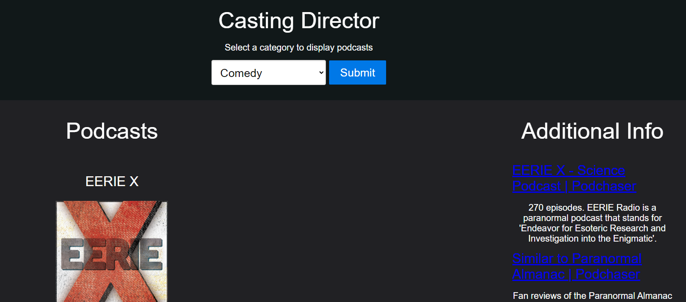

# The Podcast App

````
AS AN user that enjoys podcasts
I WANT to be able to search for category 
SO THAT I can receive a list of recommendations and reviews
````

## Acceptance Criteria

````
GIVEN the user enters a category into the search engine
THEN I am presented with the a list of podcasts based on the category
WHEN I click one of the items in the list of podcasts
THEN I will see reviews and information about that specific podcast
````

## How to run this program

1. Open the 'index.html' file in a browser
OR
2. View a live preview of our project below

## Live Preview

https://nickrearl.github.io/podcast-project/

## Screenshot



## Attributions

* [purecss](https://purecss.io/) framework
* [allfeeds](https://allfeeds.ai/) API to get data for podcasts
* [Google Custom Search](https://developers.google.com/custom-search/) API to get reviews for podcasts searched
* [onerror Event](https://www.w3schools.com/jsref/event_onerror.asp)

## Contributors

* [Nick Earl](https://github.com/nickrearl)
* [Victor Nunez](https://github.com/VN135766)
* [Caleb Barkman](https://github.com/Caleb6826)
* [Leandri Beavis](https://github.com/LeandriB)
